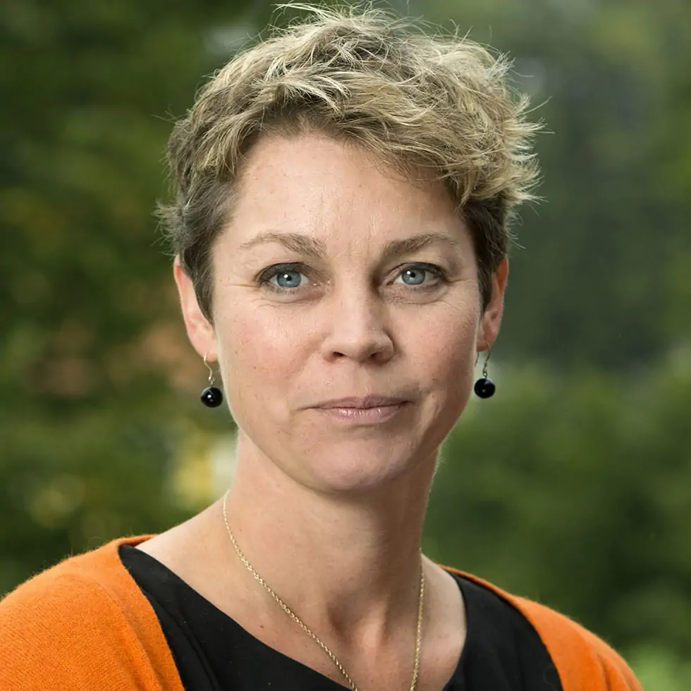
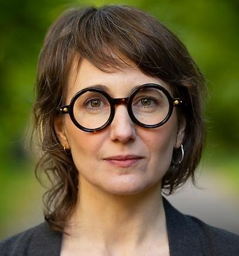
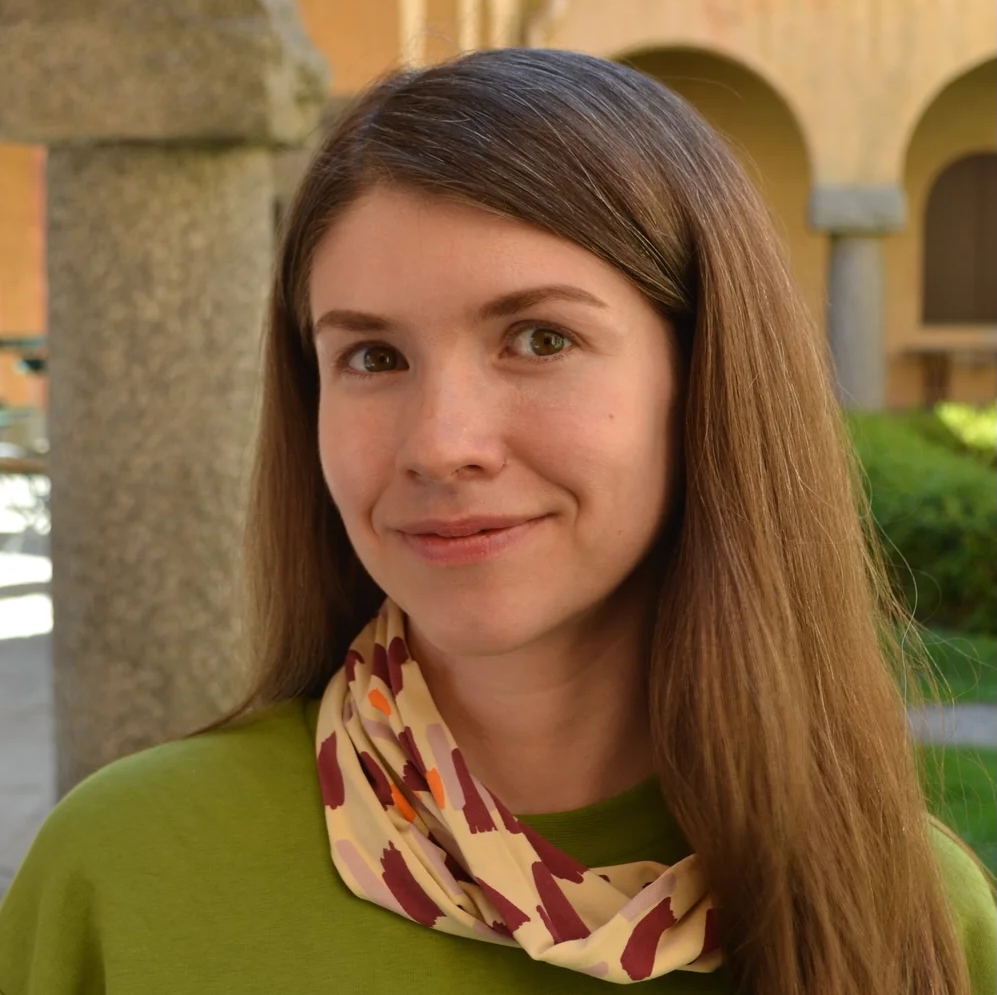
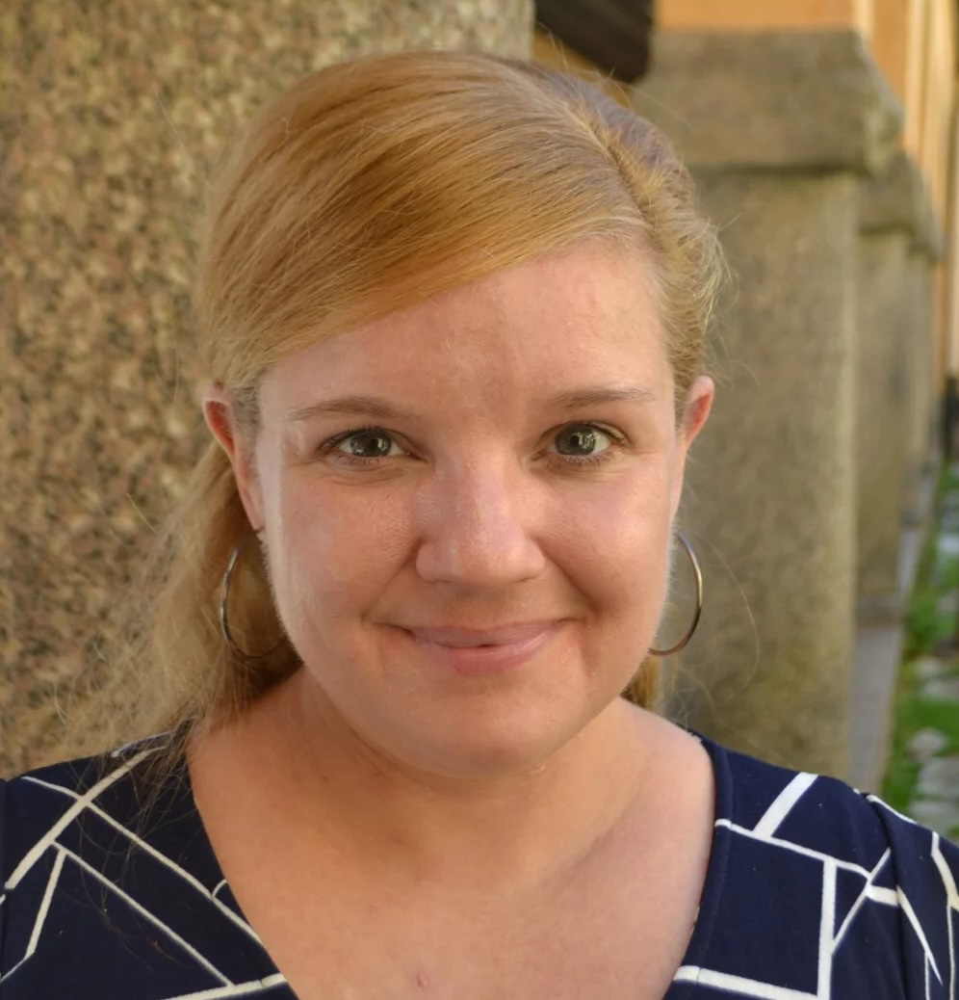
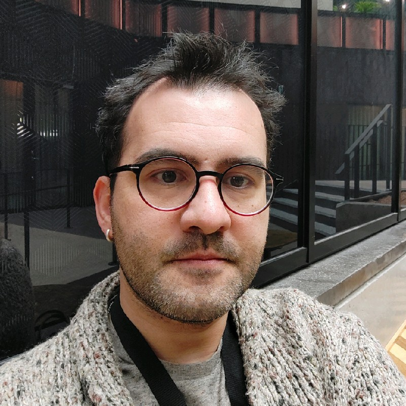
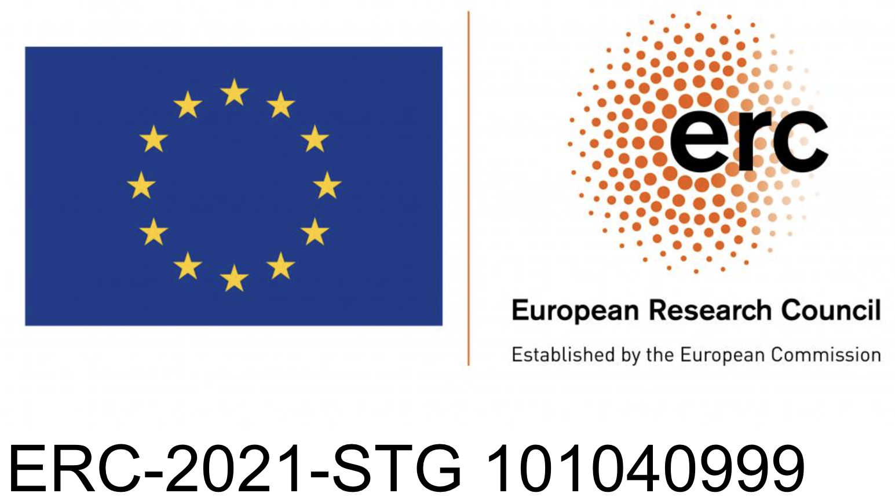

Welcome to the first **HeaLing** workshop to be held at [EACL 2026](https://2026.eacl.org/) in Rabat, Morocco.

_Tagline:_ Exploring Linguistic Analysis in Medicine and Healthcare: Bridging Hypotheses, Methods, and Insights

# Important Dates

(Tentative timeline)
- ~~First call for workshop papers: October 15, 2025~~
- ~~Second call for workshop papers: November 12, 2025~~
- ~~Third call for papers: December 5, 2025~~
- ~~Direct Submission deadline: December 19, 2025~~
- [ACL Rolling Review Pre-Reviewed submission deadline](https://aclrollingreview.org/cfp): January 10, 2026
- Notification of acceptance: January 23, 2026
- Camera-ready paper due: February 3, 2026
- Workshop date: March 28, 2026

All deadlines are 11:59pm AoE.

# Workshop Topic and Context

Language in medicine is never neutral: the ways clinicians, patients, researchers, and institutions talk and write about health reflect and shape medical knowledge, practice, and policy. In the humanities and social sciences disciplines that study medicine, healthcare and the medical professions, qualitative discourse analysis is often used as the principal method to study how diagnostic categories emerge, how metaphors and narratives frame illness, how medical records evolve, and how misunderstandings in everyday interactions have concrete clinical consequences. 

With the explosion of AI, quantitative methods are increasingly shaping how the humanities and social sciences study medicine. AI-based methods are powerful, yet their value depends on careful alignment between hypotheses, chosen methods, and the interpretation of the outputs. Without this alignment and rigorous evaluation, computational analyses risk obscuring the very concepts they aim to clarify.
The contribution of the outcomes of raw language data analyses to the future of medicine and healthcare, such as understanding how healthcare coordination is affected by societal perceptions of disease, the naming and framing of illnesses, stigmatization, and mismatched discourses, -- critically depends on this careful alignment.

This workshop will provide a forum for researchers studying medical and healthcare language in the humanities and social sciences to discuss and compare their use of both quantitative and qualitative methods in their research. It will contribute to:

- Assessing methods and evaluation: benchmark tools, document corpus design (timeframe, domain, de-identification, multilinguality), and improve reproducibility.
- Connecting methods to hypotheses: ensure that computational analyses truly capture linguistic phenomena of interest (e.g., framing, metaphor, classification).
- Improving interpretability and reliability: develop explainable models and transparent reporting so conclusions are usable across medicine, history, and policy.
- Highlighting real-world impact: present case studies of how language analysis shapes clinical practice, public health communication, or historical understanding.
- Fostering interdisciplinary exchange: bring together ACL researchers with scholars from medicine, social sciences, history, and the humanities.

# Invited Speakers

<table cellspacing="0" cellpadding="0">
  <tr>
    <td></td>
  </tr>
  <tr>
    <td><figcaption font-size=10px word-wrap="break-word" width="360" height="auto">Kirsten Ostherr, Rice University, USA</figcaption> </td>
  </tr>
</table>

**Kirsten Ostherr**, Gladys Louise Fox Professor of English at Rice University, Houston, USA. She is a leading scholar at the intersection of health communication, data science, and linguistics, focusing especially on computational practices in healthcare. Her research explores how language, technology, and data shape patient experience and medical practice. Drawing on interdisciplinary methods, she examines the promises and pitfalls of AI and digital health technologies, in particular when it comes to patient involvement, equity, and ethics. 

<!-- <table cellspacing="0" cellpadding="0">
  <tr>
    <td></td>
  </tr>
  <tr>
    <td><figcaption font-size=10px word-wrap="break-word" width="360" height="auto">Ericka Johnson, Linköping University, Sweden</figcaption> </td>
  </tr>
</table>

**Ericka Johnson** Professor of Gender and Society at Linköping University, Sweden. Her research explores how medical knowledge, technologies, and bodies are shaped by language and practice. She examines the role of synthetic data in medicine, connecting it to broader questions from feminist science and technology studies about evidence, trust, and the social life of data. By situating synthetic datasets within the history of medical recordkeeping and the politics of representation, her work highlights both their promise for innovation and their risks of reinforcing bias or obscuring patient experience. -->

# Submission Guidelines

Authors are invited to submit original and unpublished research contributions (including surveys, position and theory papers) in the following categories:

- Full Papers — up to 8 pages, presenting substantial, completed research (plus unlimited references and appendices).
- Short Papers — up to 4 pages, describing ongoing, focused, or preliminary work (plus unlimited references and appendices).

NOTE: Submissions should be self-contained. Appendices are optional and reviewers are not required to review or download them.

All submissions must be in PDF format and submitted electronically via [OpenReview](https://openreview.net/group?id=eacl.org/EACL/2026/Workshop/HeaLing). Papers should adhere to the ACL formatting guidelines, following the ACL Rolling Review (ARR) Call for Papers [ARR CfP](https://aclrollingreview.org/cfp). Please use the official ACL style templates, available [here](https://github.com/acl-org/acl-style-files) (both Word and LaTeX).

Authors of accepted papers must submit their camera-ready versions by the camera-ready deadline. One (1) additional page is allowed for addressing reviewer comments.

Papers must be submitted anonymously. We accept submissions either through our own submission page, or via the general ACL Rolling Review. All submissions will undergo double-blind peer review by at least three reviewers, with final acceptance decisions made by the workshop organizers. Accepted papers will be published in the workshop proceedings and presented orally or as posters.

The full EACL 2026 Call for Papers is available [here](/cfp).

# Program Committee
- Mathilde Aguiar, Université Paris-Saclay, France 
- Sofía Aguilar, Saarland University, Germany
- Zainab Awan, UTS, Australia
- Meriem Beloucif, Uppsala University, Sweden
- Abby Blocker, University of Cape Town, South Africa
- Layla Bouzoubaa, Drexel University, USA
- Vera Danilova, Uppsala University, Sweden
- Hannah Devinney, Linköping University, Sweden
- Simona Doneva, University of Zurich, Switzerland
- Luise Dürlich, RISE Research Institute, Sweden
- Stefania Degaetano-Ortlieb, Saarland University, Germany
<!-- - Vinu Ekayanake, University of Kentucky, USA -->
- Manas Gaur, University of Maryland, USA
- Natalia Grabar, French National Centre for Scientific Research, France
- Christina Humphreys, Uppsala University, Sweden
- Richard Kimera, Makerere University, Uganda
- Dimitrios Kokkinakis, University of Gothenburg, Sweden
- Murathan Kurfalı, RISE Research Institute, Sweden
- Chuyuan Li, University of British Columbia, Canada
- Han Meng, National University of Singapore
- Simon Meoni, Arkhn, France
- Shufan Ming, University of Illinois Urbana-Champaign, USA
- José G Moreno, Paul Sabatier University - IRIT, France
- Raymond Ng, National University of Singapore
- Phu Vinh Nguyen, Uppsala University, Sweden
- Lia Shahnazaryan, Paderborn University, Germany
- Amir Payberah, KTH, Sweden
- Lidia Pivovarova, University of Helsinki, Finland
- Ludvig Hult, Uppsala University, Sweden
- Gokul Srinath Seetha Ram, California Polytechnic State University, USA
- Ehud Reiter, University of Aberdeen, UK
- Rezvaneh Rezapour, Drexel University, USA
- Roland Roller, German Research Center for Artificial Intelligence, DFKI, Germany
- Thomas Rowlands, University of Nottingham, UK
- Ahmed Ruby, Uppsala University, Sweden
- Eugenia Rykova, Catholic University of Eichstätt-Ingolstadt, Germany
- Patrick Ruch, University of Applied Sciences, Switzerland
- Diego Saez Trumper, Pompeu Fabra University, Spain
- Arno Simons, Technische Universität Berlin, Germany
- Maria Skeppstedt, Stockholm University, Sweden
- Sarvesh Soni, National Library of Medicine
- Sara Stymne, Uppsala University, Sweden
- Thomas Vakili, Stockholm University, Sweden
- Karin Verspoor, Melbourne Institute of Technology, Australia 
- Nathan White, James Cook University, Australia
- Dongfang Xu, Cedars Sinai Medical Center, USA
- Jinghua Xu, Ruprecht-Karls-Universität Heidelberg, Germany
- Ke Yang, University of Texas at San Antonio, USA
- Zhicheng Yang, PAII labs, USA
- Tianlin Zhang, University of Chinese Academy of Sciences, People's Republic of China
- Marina Zhukova, Microsoft AI
- Xiao Yu Cindy Zhang, University of British Columbia, Canada
- Xingmeng Zhao, University of Colorado Anschutz Medical Campus, USA
- Robert Östling, Stockholm University, Sweden

# Organizers

<table class="organizer-table" cellspacing="0" cellpadding="0" style="margin-top: 20px">
  <tr>
    <td></td>
    <td></td>
    <td></td>
    <td></td>
    <td></td>
  </tr>
  <tr>
    <td><figcaption><a href="http://actdisease.org">Ylva Söderfeldt, Uppsala University, Sweden</a></figcaption></td>
    <td><figcaption><a href="http://actdisease.org">Vera Danilova, Uppsala University, Sweden</a></figcaption></td>
    <td><figcaption><a href="http://actdisease.org">Julia Reed, University of Vienna, Austria</a></figcaption></td>
    <td><figcaption><a href="https://orcid.org/0000-0001-5166-8551">Gavin Farrell, University of Padua, Italy</a></figcaption></td>
    <td><figcaption><a href="https://aclanthology.org/people/murathan-kurfali/">Murathan Kurfalı, Stockholm University, Sweden</a></figcaption></td>
  </tr>
</table>

# Contact
<!--- google groups -->
For inquiries, please contact us at <healing-workshop@googlegroups.com>
# Sponsors
<!--- Add RJ and ActDisease project -->
This workshop is supported by the [ActDisease project](https://actdisease.org) in Modern History of Medicine at Uppsala University, Sweden.
<table class="sponsor-table" cellspacing="0" cellpadding="0" style="margin-top: 20px;">
  <tr>
    <td></td>
  </tr>
</table>

# Anti-Harassment Policy
HeaLing workshop adheres to the [ACL code of ethics](https://www.aclweb.org/portal/content/acl-code-ethics), [ACL code of conduct](https://2024.eacl.org/code/), and 
[ACL anti-harassment policy](https://www.aclweb.org/adminwiki/index.php?title=Anti-Harassment_Policy). 

# Image Source
The workshop banner was created using [Canva](https://www.canva.com/)

